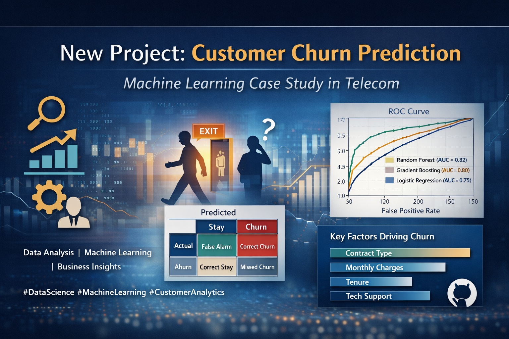
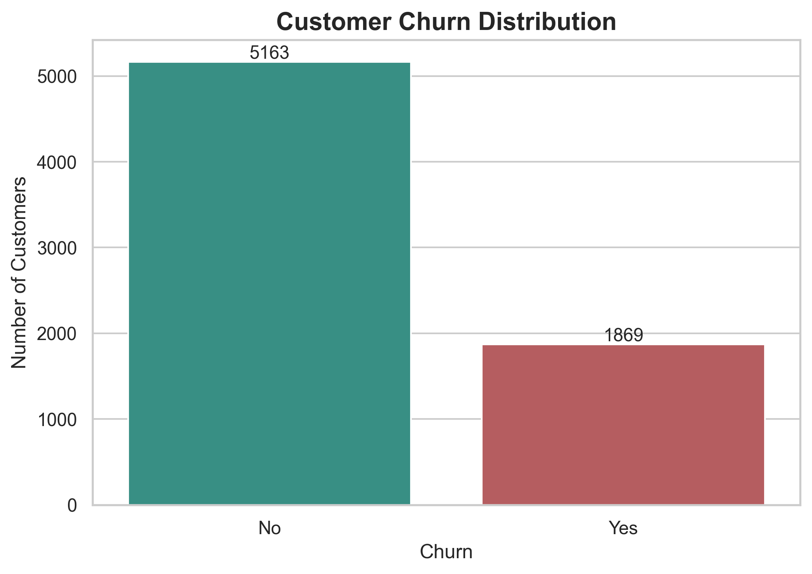
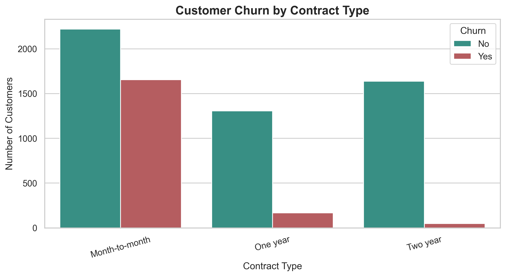
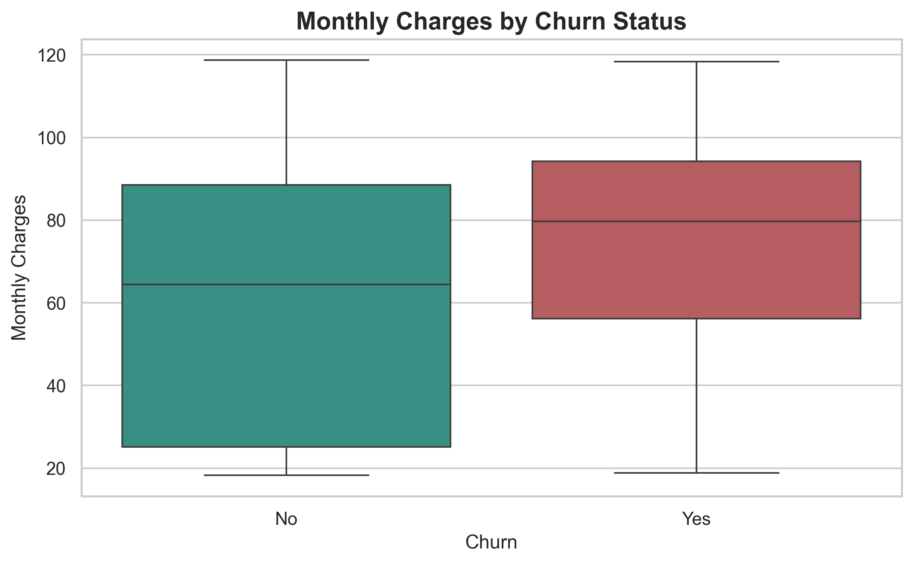
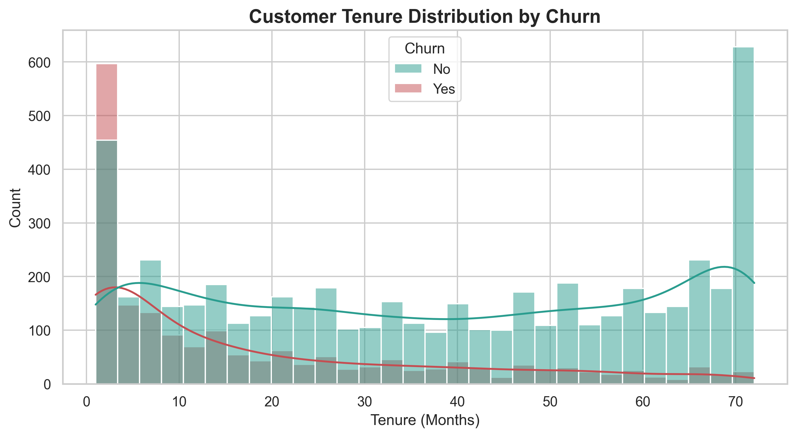

<p align="center">
  
</p>

# Customer Churn Prediction
### Machine Learning Case Study for Telecom Customer Retention


# Customer Churn Prediction

## End-to-End Machine Learning Project for Telecom Customer Retention

[](https://customer-churn-prediction-gn6hcvhahskzsrtu5ksxqt.streamlit.app/)

## 🚀 Live Demo

Try the interactive Machine Learning application:

👉 https://customer-churn-prediction-gn6hcvhahskzsrtu5ksxqt.streamlit.app/

---

## End-to-End Machine Learning Project for Telecom

Customer churn is one of the most critical business challenges in subscription-based industries such as telecommunications.

Customer churn is one of the most critical business challenges in subscription-based industries such as telecommunications. When customers leave, companies lose recurring revenue and must spend more to acquire new customers.

This project builds a **machine learning model to predict which telecom customers are likely to churn**. The goal is to help businesses identify high-risk customers early and implement retention strategies.

The project demonstrates a **complete data science workflow**, from exploratory data analysis to predictive modeling and business insight generation.

---
## Key Visualizations

### Customer Churn Distribution


This chart shows the distribution of customers who stayed versus those who churned.

---

### Churn vs Contract Type


Customers with **month-to-month contracts have significantly higher churn rates** than customers with longer contracts.

---

### Monthly Charges vs Churn


Customers paying **higher monthly charges tend to churn more frequently**.

---

### Customer Tenure Analysis


Customers with **short tenure are much more likely to leave**, highlighting the importance of early customer retention.

---

### Feature Importance


The model identifies **contract type, tenure, and monthly charges** as the most important drivers of churn.

# Project Objectives

The main objectives of this project are:

* Analyze customer behavior and identify churn patterns
* Build machine learning models to predict churn probability
* Compare model performance using multiple evaluation metrics
* Identify the most important factors driving churn
* Provide actionable business insights for improving customer retention

---

# Dataset

The project uses the **Telco Customer Churn dataset**, which contains customer demographic information, service usage details, and billing data.

Dataset characteristics:

* **7043 customers**
* **21 original features**
* Target variable: **Churn (Yes / No)**

Key variables include:

* Customer tenure
* Contract type
* Monthly charges
* Internet service type
* Payment method
* Customer support services

---

# Repository Structure

```text
customer-churn-prediction/

data/
    telco_churn.csv

notebooks/
    churn_analysis.ipynb

outputs/
    figures/
    metrics/

app.py

README.md
requirements.txt
```

---

# Exploratory Data Analysis

Exploratory analysis was conducted to understand customer behavior and churn patterns.

Visualizations include:

* Customer churn distribution
* Churn vs contract type
* Churn rate by contract
* Monthly charges vs churn
* Customer tenure distribution
* Monthly charges vs tenure relationship
* Correlation heatmap

These visualizations reveal important behavioral trends in the dataset.

---

# Key Insights from Data Analysis

Several patterns were identified during exploratory analysis:

**Contract Type**

Customers with **month-to-month contracts show significantly higher churn rates** than those with one-year or two-year contracts.

**Customer Tenure**

Customers with **short tenure are more likely to churn**, while long-term customers tend to stay.

**Monthly Charges**

Higher monthly charges are associated with **greater churn probability**, suggesting potential price sensitivity.

**Service Support**

Customers without services like **tech support or online security** tend to churn more frequently.

---

# Machine Learning Models

Three machine learning models were trained and evaluated:

### Logistic Regression

A strong baseline classification model that performs well on structured datasets.

### Random Forest

An ensemble tree-based model capable of capturing non-linear relationships.

### Gradient Boosting

A boosting algorithm that improves prediction performance through iterative learning.

---

# Model Evaluation

Models were evaluated using the following metrics:

* Accuracy
* Precision
* Recall
* F1 Score
* ROC-AUC

ROC-AUC is particularly important because it measures the model’s ability to distinguish between churners and non-churners.

The models achieved performance levels consistent with real-world churn prediction tasks.

---

# Feature Importance

Feature importance analysis shows which variables most influence customer churn.

Top churn drivers typically include:

* Contract type
* Customer tenure
* Monthly charges
* Internet service type
* Tech support availability

Understanding these drivers helps translate machine learning results into business strategy.

---

# Business Recommendations

Based on the analysis and model results, telecom companies could reduce churn by:

* Encouraging customers to adopt **long-term contracts**
* Offering **loyalty incentives for new customers**
* Improving **customer support services**
* Identifying high-risk customers for **targeted retention campaigns**

---

# Interactive Machine Learning App

This project also includes a **Streamlit web application** that allows users to input customer details and predict churn probability in real time.

To run the application:

```bash
streamlit run app.py
```

The app provides an interactive interface for exploring churn predictions and business insights.

---

# Technologies Used

Python
Pandas
NumPy
Scikit-learn
Matplotlib
Seaborn
Streamlit
Jupyter Notebook

---

# How to Run the Project

Clone the repository:

```bash
git clone https://github.com/YOUR_USERNAME/customer-churn-prediction.git
```

Install dependencies:

```bash
pip install -r requirements.txt
```

Run the analysis notebook:

```bash
notebooks/churn_analysis.ipynb
```

Run the Streamlit application:

```bash
streamlit run app.py
```

---

# Project Value

This project demonstrates several essential data science skills:

* Data cleaning and preprocessing
* Exploratory data analysis and visualization
* Machine learning model development
* Model evaluation and comparison
* Feature importance analysis
* Business-focused data storytelling
* Interactive ML deployment

These capabilities are essential for **data analyst, data scientist, and machine learning roles**.

---

# Author

**Noor Saba**

Aspiring Data Scientist specializing in data analytics, machine learning, and business intelligence.

---
